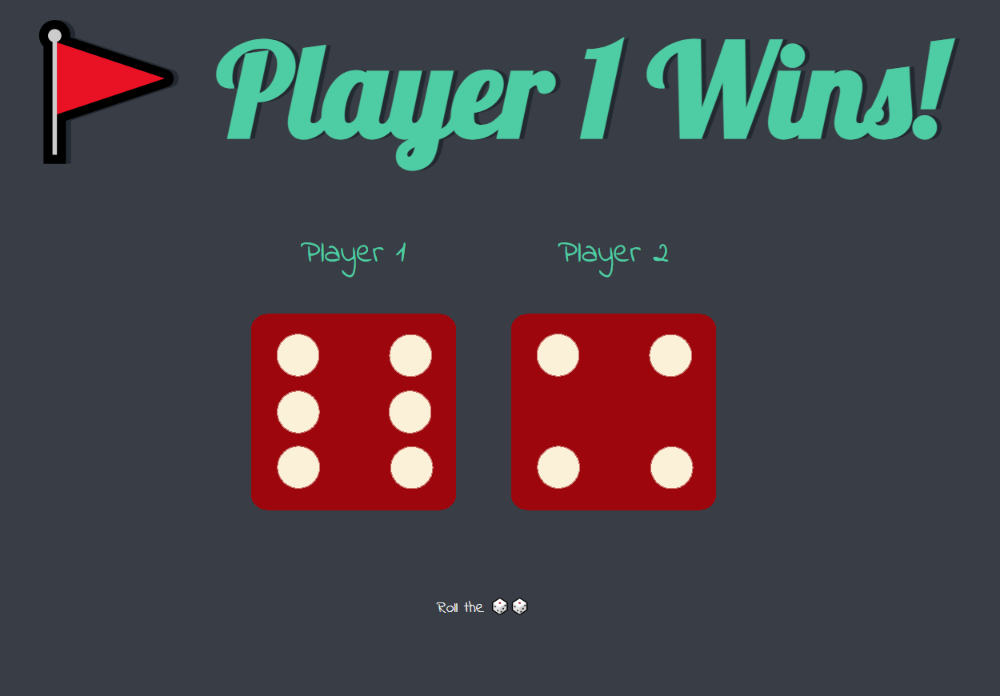

# 01_Dice_Game

This is a game where, each time the website gets refreshed, the dice will get rolled automatically.
The player with the highest number wins! The number rolled is chosen randomly.

---

**Example views from the website:** 
 

 

---

 

---

 

---

 

---

**The program was developed using HTML, CSS, JavaScript**

In order to run the program, you have to open dicee.html.