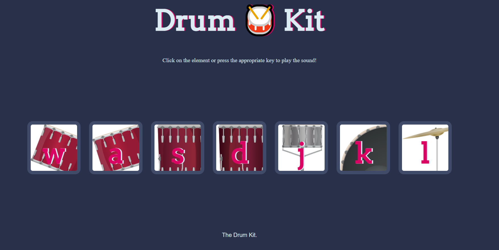

# 02_Drum_Kit

This is a website where the user can play a sound by pressing the keyboard keys "w," "a," "s," "d," "j," "k," "l," or by clicking on a picture on the website. It is a fun way of creating music by randomly selecting elements. 

---

**Example views from the website:** 
 

 

---

 

---

**The website was developed using HTML, CSS, JavaScript**

In order to run the program, you have to open index.html.