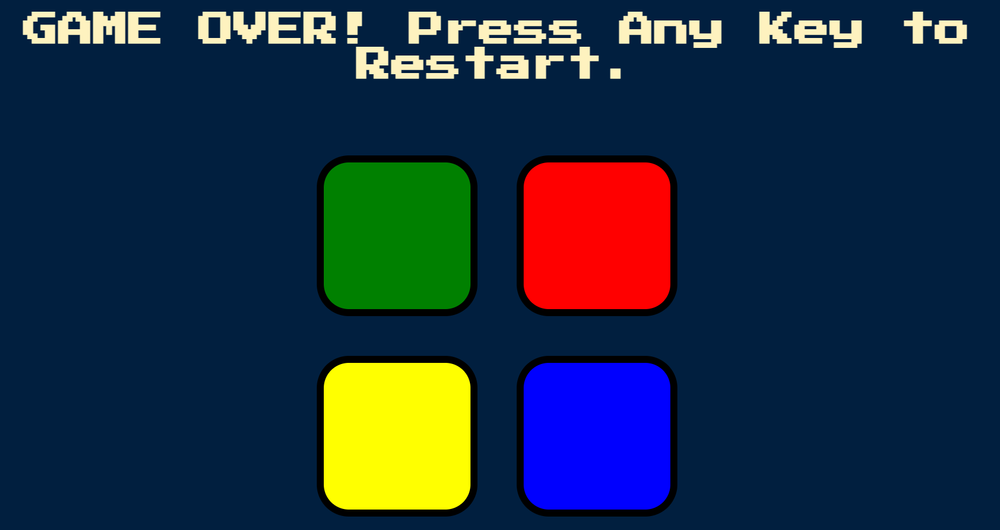
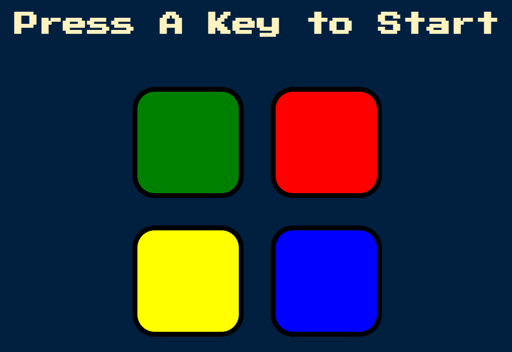
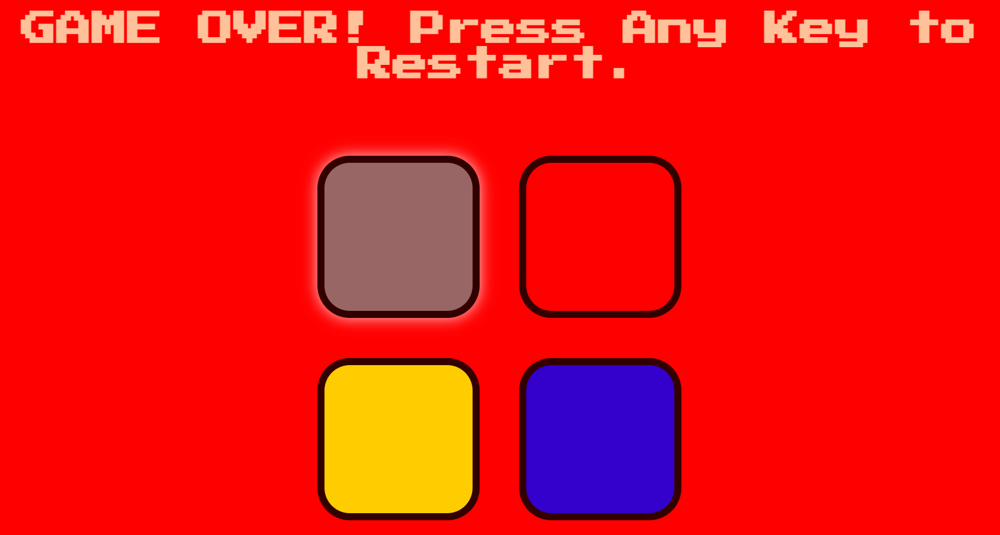
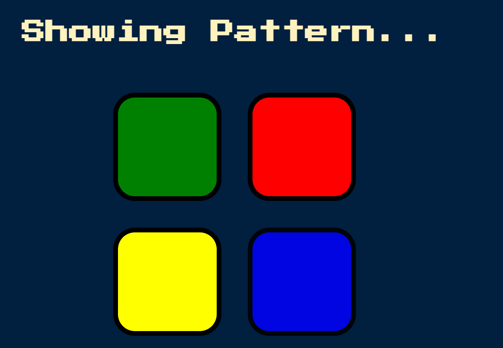
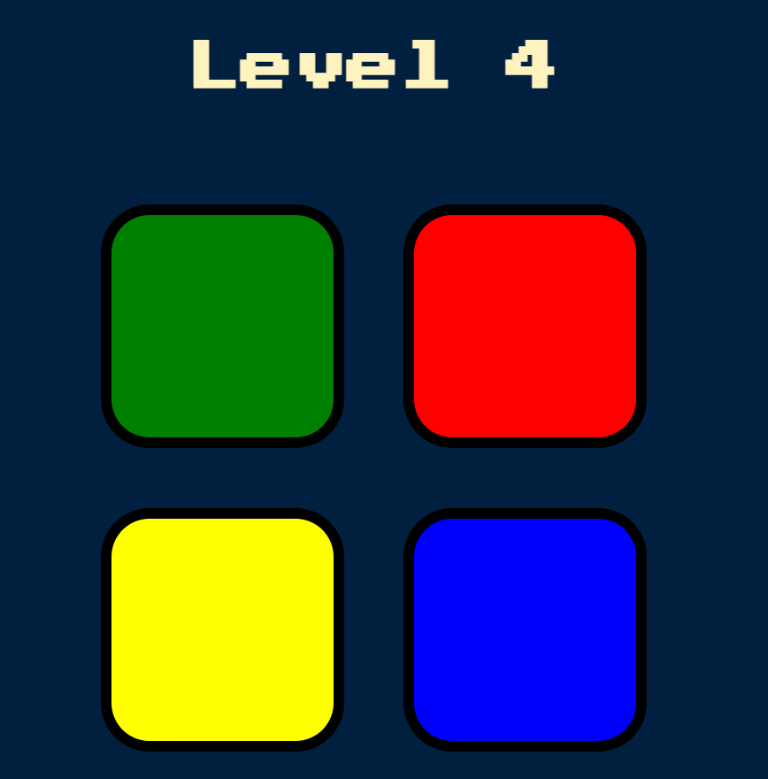

# 03_Simon_Game

This game is based on the popular Simon game https://en.wikipedia.org/wiki/Simon_(game).
The user has to press any key to start the game, and then it will start showing you the tiles you have to click on, and every time you correctly press the pattern shown, it will move to the next level. Every level will have more complex patterns (always new random patterns) to follow to make it harder for the user to pass. This way, the game will increase in difficulty. At some point, if you choose the wrong tile, it will end the game. The sound effect will help the user identify whether the level was passed or failed and whether a tile was pressed. The program was developed using HTML, CSS, JavaScript, and jQuery.

---

**Example views from the website:** 
 

 

 

 

 

 

---

 

---

**The program was developed using HTML, CSS, JavaScript, jQuery**

In order to run the website, you have to open index.html.